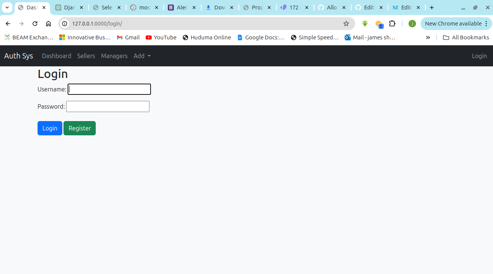
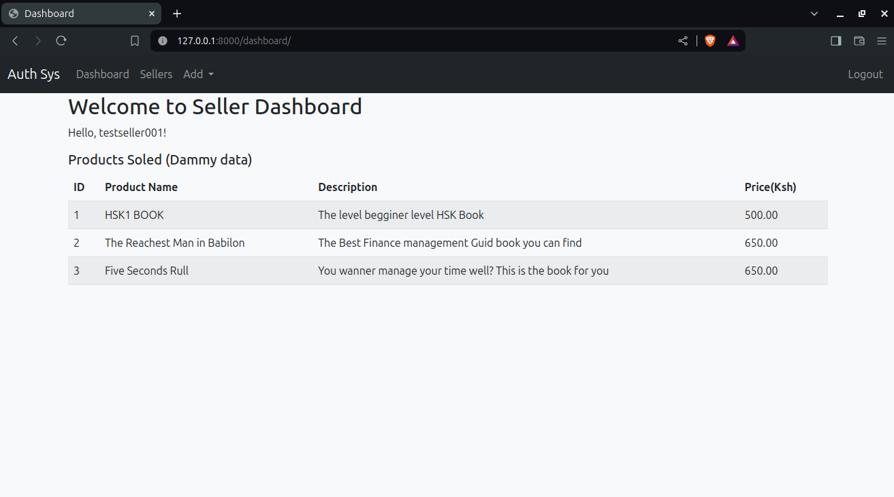
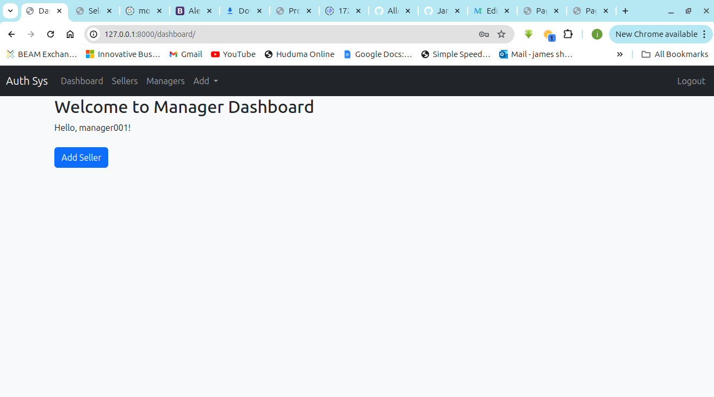
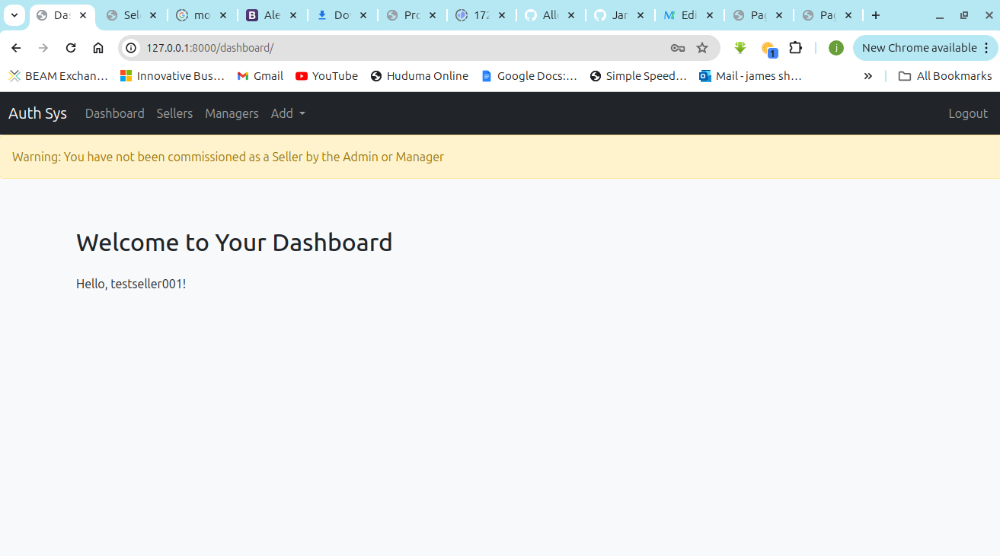

# Hierarchical Roles

Hierarchical Roles (Auth Sys) is an Authentication system with Hierarchical Roles

## Instalation

Run the following code in Command line

1. Clone the repositiory  `git clone https://github.com/James-Shadrack-Wafula/hierarchical_roles.git`
2. Install requirements  `pip install requirements.txt`
3. Navigate to hierarchical_roles directory  `cd hierarchical_roles`
4. Makemigration `cd base`  `python manage.py makemigrations` `python manage.py migrate`
5. Run server `python manage.py runserver`

## Run the program

On your favorite browser, follow the following link  [http://127.0.0.1:8000](http://127.0.0.1:8000)   

To see the Super User's Dashbord, follow this line [http://127.0.0.1:800/admin](http://127.0.0.1:8000/admin/)

Username: `jimmy`

Password: `jo`

## **Usage**

The firs time you open, you will get the following page requesting you to login

 

Use any for the Test Credantials bellow 

#### **Seller**

username: `testseller001`

password: `@person123`

The following is a snapshot of Seller dashbord

#### **Manager**

username: `manager001`

password: `@person123`

The following is the snapshot of Manager Dashbord

#### **Admin**

username: `admin001`

password: `@person123`

### Note:

If you register for the first time as a seller you should not be able to see the Seller Dashbord untill you are commissioned by the Manager or Admin.

=======
>>>>>>> 28e7d4fb0298cc0679180aba37970c0a667b22aa
